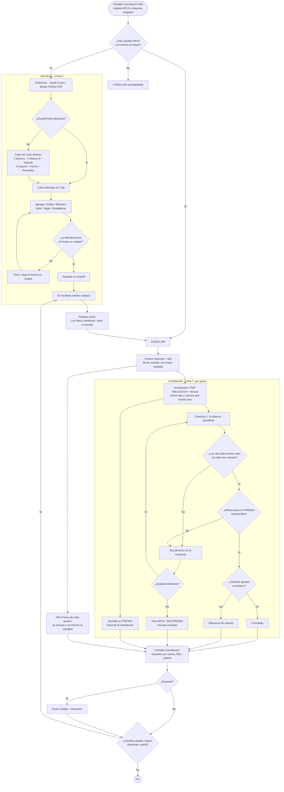

# Conciliación de Percepciones y Retenciones (PyR) — guía de diseño

TAREA 00041 · Módulo `ArcaCliente` · Líneas 2, 3 y 4 (la Línea 1 fue el duplicado inicial).

> Esta guía cumple el rol del spec de brainstorming para esta tarea (el `CLAUDE.md` del repo
> los ubica en `docs/superpowers/specs/`); se deja acá, junto a las maquetas, para no tener
> dos documentos del mismo diseño que se desincronicen.

## Qué es

Una copia de la **Conciliación Offline de ARCA** adaptada a percepciones y retenciones: de un
lado los certificados que informan los agentes en ARCA (y en rentas provincial para IIBB), del
otro el mayor contable de PRESEA de cada cuenta de percepciones/retenciones.

Esta etapa cubre **perfil, lectura de la carpeta de ARCA y lectura de los mayores de PRESEA**.
Las directivas y la conciliación propiamente dicha quedan para la etapa siguiente: la pantalla
se construye con el botón **CONCILIAR** visible pero deshabilitado.

## Pedido

> 1. *(ya registrada)* Duplicar los modelos, servicios y formularios de ARCA OffLine.
> 2. Tenemos que colocar en el perfil qué cuenta significa percepción y cuál retención.
> 3. Hacer como con ARCA una carpeta donde vamos a tomar todo el contenido como base de datos.
> 4. Levantar los archivos que van a contener las percepciones y las retenciones del sistema.
>    A diferencia de ARCA, acá viene el tipo de comprobante y el documento en la misma casilla
>    de concepto, una columna de debe y otra de haber.
> 5. *(21/09/2026, después de probarlo)* Que deje tomar dos archivos de PRESEA, uno por cada
>    cuenta configurada.
> 6. *(21/09/2026)* Directivas de conciliación.
> 7. *(21/09/2026)* Conciliación. Aclaración del pedido: "solo debe conciliar contra las cuentas
>    subidas en el archivo de PRESEA. Por ejemplo en mi ejemplo solo tenemos percepciones."

## Archivos de ejemplo (julio 2026)

Ruta: `D:\DESARROLLOS CONTABLE\CONCILIADOR\PERCEP Y RETEN\`

| Archivo | Formato real | Contenido |
|---|---|---|
| `presea\PERC. IVA 07-2026.XLSX` | xlsx | Mayor de **una** cuenta: `fecha, asiento, incidencia, origen, concepto, centro, debe, haber, saldo`. 2056 filas. |
| `presea\PERC. IIBB 07-2026.XLSX` | xlsx | Ídem, 984 filas. |
| `arca\Percepciones IVA 07-2026.xls` | **xls binario (BIFF)** | Hoja "Retenciones Impositivas", formato "Mis Retenciones" de AFIP. |
| `arca\Retenciones y Percepciones II.BB 07-2026.xls` | **HTML** con extensión `.xls` | Tabla `Cuit, Nombre, Operación, Fecha, Comprobante, Importe` (consulta provincial). |

## Modelo de datos

### Perfil — `PerfilOfflinePyR` (Línea 2)

*(Ajustado al implementar)* De la copia quedan hoja, cabecera, formato de fecha, separador
decimal y directivas. Se **quitaron** tipo de archivo, separador, encoding y las posiciones
`Pos*`: PRESEA exporta el mayor siempre en Excel, así que el tipo de archivo se muestra fijo
("Excel (.xlsx / .xls)", deshabilitado), y sin cabecera las mismas casillas `Col*` se cargan
con el número de columna (1, 2, 3…) en vez de duplicar los campos.

| Campo | Tipo | Notas |
|---|---|---|
| `ColFecha`, `ColAsiento`, `ColConcepto`, `ColDebe`, `ColHaber` | string | Nombre del encabezado, o número de columna si no hay cabecera. |
| `CarpetaArca` | string | Renombre de `CarpetaCsvArca`: ya no son sólo CSV. |
| `Cuentas` | `List<CuentaPyR>` | Ver abajo. |

Defaults de columnas pensados para el mayor de PRESEA: `fecha`, `asiento`, `concepto`, `debe`,
`haber`.

`CuentaPyR`:

| Campo | Tipo | Valores |
|---|---|---|
| `Id` | Guid | |
| `Codigo` | string | Código de la cuenta contable en PRESEA. Obligatorio, único dentro del perfil. |
| `Nombre` | string | Obligatorio. Ej. "Percepciones IVA". |
| `Tipo` | enum `TipoOperacionPyR` | `Percepcion`, `Retencion` |
| `Impuesto` | enum `ImpuestoPyR` | `Iva`, `Iibb`, `Ganancias` |

Persistencia: tabla nueva `arca.ArcaPerfilesPyR` en `ArcaSqlSchema.cs`, con el mismo patrón
que `ArcaPerfilesOffline` (mismas columnas de lectura de archivo, sin `ColPuntoVenta`,
`ColNumero`, `ColTipoComprobante`, `ColCuit`, `ColNombreProveedor`, `ColTotal`,
`SistemaExportacion`, `ConfigPreseaJson`, `TipoArchivo`, `Separador`, `Encoding` ni `Pos*`),
más `ColAsiento`, `ColConcepto`, `ColDebe`, `ColHaber`, `CarpetaArca`,
`CuentasJson NVARCHAR(MAX) NOT NULL DEFAULT '[]'` y `DirectivasJson`. Acceso en
`ArcaSqlStorage` (`LoadPerfilesPyR` / `SavePerfilesPyR`) detrás de `PerfilPyRStorage`.

Se **elimina** `Models/Conciliacion PyR/PerfilFiscal.cs` (`PerfilFiscalPyR`): es el perfil
online (usuario, clave fiscal, API) y esta conciliación trabaja sólo con archivos.

### Fila de ARCA — `RegistroArcaPyR` (Línea 3)

| Campo | Origen AFIP (xls/xlsx) | Origen provincial (HTML) |
|---|---|---|
| `Cuit` | CUIT Agente Ret./Perc. | Cuit |
| `Denominacion` | Denominación o Razón Social | Nombre |
| `Impuesto` | Código de Impuesto: 767 → IVA, 217 → Ganancias, otro → no reconocido | Siempre IIBB |
| `Operacion` | Descripción Operación (PERCEPCION / RETENCION) | Operación (Percepción / Retención) |
| `Fecha` | Fecha Ret./Perc. | Fecha |
| `TipoComprobante` | Descripción Comprobante (FACTURA, NOTA DE CREDITO, …) | Texto antes del número en Comprobante ("Factura", "Nota Crédito", "Liquidación de pago") |
| `Letra` | — (no la informa) | Letra pegada al número, si hay ("Factura **A**000200118618") |
| `Numero` | Número Comprobante **sin ceros a la izquierda** | Dígitos de Comprobante sin ceros a la izquierda |
| `NumeroCertificado` | Número Certificado | — |
| `Importe` | Importe Ret./Perc. | Importe |
| `ArchivoOrigen` | nombre del archivo | nombre del archivo |

Regla del número: se normaliza igual de los dos lados (sólo dígitos, sin ceros a la izquierda),
así `Factura A000200118618` y `001000215963` quedan `200118618` y `1000215963`, que es como
los escribe PRESEA.

### Fila de PRESEA — `RegistroPreseaPyR` (Línea 4)

| Campo | Origen |
|---|---|
| `Cuenta` | La `CuentaPyR` elegida al agregar el archivo (de ahí salen Tipo e Impuesto). |
| `Fecha`, `Asiento` | Columnas del perfil. |
| `ConceptoOriginal` | Columna concepto, tal cual. |
| `TipoComprobante` | Parte del concepto, ej. "FACTURA A", "NOTA DE CREDITO A". |
| `Numero` | Parte del concepto, sin ceros a la izquierda. |
| `Proveedor` | Parte del concepto después de " de " (viene cortado a 16 caracteres por PRESEA). |
| `EsAnulacion` | El concepto empieza con "POR ANULACION". |
| `SinComprobante` | El concepto no respeta el patrón (ver reglas). |
| `Importe` | debe − haber (con signo). |
| `ArchivoOrigen` | nombre del archivo. |

## Reglas

### Lectura de la carpeta de ARCA

1. Se leen todos los archivos `*.xls`, `*.xlsx`, `*.htm`, `*.html` de la carpeta (sin
   subcarpetas). Los temporales de Office (`~$*`) se ignoran.
2. **El formato se detecta por contenido, no por extensión**:
   - Empieza (salteando blancos/BOM) con `<` → HTML: se toma la primera `<table>` con
     encabezados `Cuit … Importe`. Parser propio de `<tr>/<th>/<td>` +
     `WebUtility.HtmlDecode`, sin dependencias nuevas.
   - Firma OLE (`D0 CF 11 E0`) o ZIP (`PK`) → Excel, leído con **ExcelDataReader** (se agrega
     al `.csproj` de ArcaCliente la misma versión que usa LiquidacionesAuditar, 3.8.0).
     Se busca la hoja cuyo encabezado contenga `CUIT Agente Ret./Perc.`.
   - Cualquier otra cosa → archivo no reconocido.
3. Un archivo no reconocido, o una fila con impuesto no reconocido, **no corta la carga**:
   se cuenta y se informa al final ("2 archivos cargados, 1 no reconocido: X.xls").
4. Si la carpeta no existe o no tiene ningún archivo reconocible → error, no se carga nada.
   *(Decisión tomada al implementar)* Un archivo con **contenido idéntico** a otro ya leído se
   saltea y se informa ("es idéntico a X"): el portal provincial baja el reporte como
   `Listado - <fecha>.xls`, y bajarlo dos veces duplicaba en silencio todos los importes de IIBB
   (pasó con la carpeta de ejemplo el 18/09).
5. Al cargar bien, `CarpetaArca` se guarda en el perfil (igual que hoy `CarpetaCsvArca`).
6. Encabezados: se comparan normalizados (sin tildes, minúsculas, espacios colapsados),
   porque el xls de AFIP viene en Latin-1 ("Denominaci�n").
7. Encoding del HTML provincial: viene en **UTF-8 sin BOM y sin `charset` declarado**, así que
   se decodifica explícitamente como UTF-8 (y, si los bytes no son UTF-8 válido, como
   Windows-1252). Adivinarlo da mojibake: "Retención" en vez de "Retención", y la operación
   deja de reconocerse.

### Lectura de los mayores de PRESEA

1. El perfil tiene que tener al menos una cuenta; si no, **Agregar** está deshabilitado con
   el aviso "El perfil no tiene cuentas configuradas".
2. **Agregar** pide el archivo y, en un diálogo, **a qué cuenta del perfil corresponde**.
   Una cuenta tiene a lo sumo un archivo cargado: si ya había uno, se pregunta si se reemplaza.
   *(Línea 5)* El combo arranca en la **primera cuenta que todavía no tiene mayor**, y las que ya
   tienen muestran cuál: "… (ya cargada: PERC. IVA 07-2026.XLSX)". Antes arrancaba siempre en la
   primera cuenta y el segundo archivo, sin tocar el combo, pedía reemplazar al primero.
3. Faltan columnas del perfil en el encabezado → error con la lista de las que faltan; el
   archivo no se agrega.
4. Patrón del concepto (sin distinguir mayúsculas, espacios múltiples colapsados):

   ```
   ^(SEGUN|POR ANULACION)\s+(?<tipo>.+?)\s+(?<numero>\d+)(?:\s+de\s+(?<proveedor>.*))?$
   ```

   Ejemplos reales:
   - `SEGUN FACTURA A    36900627623 de CIA INDUSTRIAL C` → FACTURA A · 36900627623 · CIA INDUSTRIAL C
   - `SEGUN NOTA DE CREDITO A ...` → NOTA DE CREDITO A
   - `POR ANULACION FACTURA A    73200019077` → FACTURA A · 73200019077, `EsAnulacion = true`,
     sin proveedor: las anulaciones de PRESEA **no traen " de …"** (22 en julio), por eso esa
     parte del patrón es opcional.
5. Lo que no respeta el patrón (en julio: `Según MINUTA FINANCIERA Nº …`, `M.FINANCIERA`) se
   carga igual con `SinComprobante = true` y se **resalta** en la grilla. No se descarta: las
   directivas de la etapa siguiente deciden qué hacer con esas filas.
6. Filas con fecha vacía o debe y haber vacíos se ignoran (totales, renglones en blanco).
7. **Quitar** saca el archivo seleccionado de la lista.

### Generales

- Todo lo leído queda **en memoria** mientras la pantalla está abierta, como en la
  Conciliación Offline. No se persisten filas.
- CONCILIAR queda deshabilitado en esta etapa.

## Pantallas

| Pantalla | Base | Cambio |
|---|---|---|
| Perfiles PyR | copia de `FormPerfilesOffline` | Sólo título y tipos. Sin maqueta (no cambia). |
| Detalle de perfil PyR | copia de `FormPerfilOfflineDetalle` | Columnas Fecha/Asiento/Concepto/Debe/Haber en vez de las de comprobante; **grilla de cuentas** con Agregar/Editar/Quitar; se quita la sección de exportación a sistema. |
| Cuenta PyR (diálogo) | nuevo | Código, Nombre, Tipo, Impuesto. |
| Elegir cuenta (diálogo) | nuevo | Combo con las cuentas del perfil ("1.1.4.05 — Percepciones IVA (Percepción · IVA)"), al agregar un mayor. |
| Conciliación PyR | copia de `FormComprobantesOffline` | Grupo ARCA: carpeta + Cargar + resumen por impuesto/operación. Grupo PRESEA: lista de archivos (Archivo · Cuenta · Filas · Sin comprobante) con Agregar/Quitar. Dos grillas de resultado (ARCA / PRESEA). CONCILIAR deshabilitado. |

Entrada desde el menú *(ajustado al implementar)*: `FormMenu` de ArcaCliente no se instancia en
ningún lado; la entrada real es el menú principal del shell (`FormMenuPrincipal`), panel ARCA:
botones **"Percepciones y Retenciones"** (elegir perfil → pantalla, igual que Offline) y
**"Perfiles PyR"**, los dos con el permiso nuevo `ArcaPyR` (criterio de TAREA 00021: un
permiso por módulo; los usuarios no admin no lo ven hasta que se les otorgue).

Decisiones tomadas al implementar, que ni la guía ni las maquetas cubrían:

- El combo **Perfil** del pie de la pantalla principal permite cambiar de perfil; como cambian
  las cuentas, lo cargado se descarta, con confirmación si había algo cargado.
- El código de cuenta repetido se valida **al guardar el perfil** (como la maqueta de error),
  no en el diálogo de cuenta; las filas en conflicto se pintan en rojo.
- Archivos repetidos de la carpeta de ARCA se informan como "repetido(s), se salteó", aparte
  de los no reconocidos. El motivo de cada uno va en el tooltip de la línea de estado.
- El resumen por impuesto/operación de ARCA es texto plano ("IVA · Percepción: 2.569"): el
  formato HTML de Telerik se comía el espacio antes del número en negrita.

## Flujograma

Exportado en `00-flujograma.png`.


## Maquetas

- `01-perfil-pyr-detalle.png` — perfil con 3 cuentas cargadas (Perc. IVA, Perc. IIBB, Ret. IIBB).
- `01-perfil-pyr-detalle-vacio.png` — perfil nuevo, grilla de cuentas vacía.
- `01-perfil-pyr-detalle-error.png` — intento de guardar con código de cuenta repetido.
- `02-cuenta-pyr.png` — diálogo de alta/edición de cuenta.
- `03-elegir-cuenta.png` — diálogo de elegir cuenta al agregar un mayor de PRESEA.
- `04-conciliacion-pyr.png` — carpeta ARCA cargada (2 archivos) y 2 mayores de PRESEA cargados, con filas "sin comprobante" resaltadas.
- `04-conciliacion-pyr-vacio.png` — pantalla recién abierta, nada cargado.
- `04-conciliacion-pyr-error.png` — carpeta con un archivo no reconocido y un mayor rechazado por columnas faltantes.

## Orden de implementación

1. Limpieza de la copia: borrar `PerfilFiscalPyR`; mover `Models/Conciliacion PyR/` a un
   nombre sin espacio (`Models/PyR/`) y ajustar el `.csproj` (la entrada `<Folder>` actual
   apunta a una carpeta que no existe).
2. Modelos: `CuentaPyR`, enums, `PerfilOfflinePyR` ajustado, `RegistroArcaPyR`,
   `RegistroPreseaPyR`.
3. Esquema y storage: `arca.ArcaPerfilesPyR` + `LoadPerfilesPyR` / `SavePerfilesPyR`.
4. Pantallas de perfil: lista, detalle con grilla de cuentas, diálogo de cuenta. (Línea 2)
5. `ArcaPyRImporter` (detección de formato, lector AFIP, lector HTML, normalización). (Línea 3)
6. `PreseaPyRImporter` + parser de concepto. (Línea 4)
7. `FormConciliacionPyR` + diálogo de elegir cuenta + entrada en el menú. (Líneas 3 y 4)
8. Verificación con los cuatro archivos de ejemplo: cantidades leídas por archivo, filas sin
   comprobante (en julio: 17 en Perc. IVA) y números normalizados que coincidan entre ambos
   lados en una muestra.

---

# Segunda etapa — Directivas y conciliación (Líneas 6 y 7)

Decisiones acordadas con el usuario el 21/09/2026:

| Tema | Decisión |
|---|---|
| Directivas por defecto | Tres, en orden, editables por perfil (la primera fija, como en Offline). |
| Anulaciones de PRESEA | Se neutralizan si la factura y su anulación suman cero. |
| Importes | Comparación **exacta**: cualquier diferencia, aunque sea de centavos, es "Diferencia de importe". |
| Resultado | Pestaña "Conciliación" en la misma pantalla. |
| Exportación | A Excel, con hoja de detalle y hoja de resumen por cuenta. |

## Lo que mostraron los datos de julio

Cruce sólo por número, dentro de cada cuenta:

| | Perc. IVA | Perc. IIBB |
|---|---|---|
| Mismo número y mismo importe | 1662 | 840 |
| Mismo número, importe distinto | 24 (9 por centavos) | 20 (11 por centavos) |
| PRESEA sin par por número | 343 | 120 |
| ARCA sin par | 891 (534 son "Otro comprobante": bancos y tarjetas) | 33 |

- AFIP no siempre escribe el número como PRESEA: DREAMCO `166000442096` (ARCA) contra
  `16600442096` (PRESEA); ALIMENTOS SARANDI `315520` (ARCA, sin punto de venta) contra
  `10200315520`. Por eso existe el campo **Número (últimos 8 dígitos)**.
- Las notas de crédito vienen en negativo en los dos lados: se compara con signo.

## Modelo de datos

### `DirectivaPyR` (Línea 6)

Propia de PyR: la `DirectivaConciliacion` de Offline tiene CUIT y punto de venta, que el mayor de
PRESEA no trae. Se guarda en la columna `DirectivasJson` que `arca.ArcaPerfilesPyR` ya tiene
(hoy vacía en todos los perfiles, así que cambiar su tipo no rompe nada).

| Campo | Tipo |
|---|---|
| `Id` | Guid |
| `Descripcion` | string |
| `Campos` | `List<CampoPyR>` |

`CampoPyR` y cómo arma la clave de cada lado:

| Campo | ARCA | PRESEA |
|---|---|---|
| `Numero` | Número normalizado | Número normalizado |
| `NumeroUltimos8` | Últimos 8 dígitos del número (con ceros a la izquierda si tiene menos) | Ídem |
| `Importe` | Importe con signo, 2 decimales | Importe (debe − haber), 2 decimales |
| `Fecha` | Fecha ret./perc. | Fecha del asiento |
| `Proveedor` | Primeras 6 letras/dígitos de la denominación, sin espacios, puntos ni tildes, en mayúsculas | Ídem sobre el proveedor del concepto (cortado a 16 por PRESEA) |

Si a una fila le falta el valor de algún campo de la directiva (por ejemplo, una fila sin
comprobante no tiene número ni proveedor), **esa directiva no la empareja**: dos vacíos no son
una coincidencia.

Directivas por defecto (se crean si el perfil no tiene ninguna):

1. **Número completo**: fija, no se edita ni se borra.
2. **Últimos 8 dígitos + Importe**: cubre los casos de DREAMCO y ALIMENTOS SARANDI.
3. **Importe + Fecha + Proveedor**: la más floja, por eso va última.

### Resultado — `ItemConciliacionPyR` (Línea 7)

| Campo | Notas |
|---|---|
| `Estado` | `Conciliado`, `DiferenciaImporte`, `SoloArca`, `SoloPresea`, `AnuladaPresea` |
| `Cuenta` | Cuenta del mayor (para los `SoloArca`, la del grupo impuesto + tipo) |
| `Directiva` | Número y descripción de la directiva que emparejó (vacío si no emparejó) |
| `Arca` | `RegistroArcaPyR` o null |
| `Presea` | `RegistroPreseaPyR` o null |
| `Diferencia` | Importe ARCA − importe PRESEA, sólo en `DiferenciaImporte` |

## Reglas de la conciliación (Línea 7)

1. **Alcance: sólo las cuentas con mayor cargado.** Se arman grupos por (impuesto, tipo) con las
   cuentas que tienen mayor en la pantalla. Las filas de ARCA de un impuesto + tipo sin mayor
   cargado **quedan fuera**: no aparecen como "Sólo ARCA", sólo se informa cuántas se
   excluyeron ("392 registros de ARCA fuera de alcance: IIBB · Retención"). Si dos cuentas
   comparten impuesto + tipo, sus mayores se concilian juntos contra ese grupo de ARCA.
2. **Anulaciones, antes de las directivas.** Dentro de cada mayor, cada fila `POR ANULACION`
   busca una fila sin anulación del mismo tipo y número cuyo importe sume cero con ella. Si la
   encuentra, las dos quedan `AnuladaPresea` y no se concilian. Si no, la anulación sigue como
   una fila más.
3. **Directivas en orden.** Cada directiva trabaja sobre lo que las anteriores no emparejaron.
   Se indexa PRESEA por la clave de la directiva (si hay repetidos gana el primero libre, igual
   que Offline) y se busca cada fila de ARCA pendiente. El emparejamiento es uno a uno.
4. **Importe exacto.** Si la directiva no incluye Importe, la pareja es `Conciliado` cuando los
   importes son iguales al centavo, y `DiferenciaImporte` si no.
5. Lo que queda sin par es `SoloArca` o `SoloPresea`. Las filas sin comprobante de PRESEA
   (minutas) terminan en `SoloPresea`, salvo que alguna directiva sin número ni proveedor las
   empareje.
6. **El resultado caduca.** Si después de conciliar se carga la carpeta, se agrega o quita un
   mayor, se cambian las directivas o se cambia de perfil, la pestaña Conciliación se vacía con
   el aviso "Los datos cambiaron: volvé a conciliar".
7. CONCILIAR se habilita cuando hay carpeta de ARCA cargada y al menos un mayor.
8. Las filas de ARCA con **importe 0** se excluyen antes de conciliar y se informan con el
   aviso de alcance (ver "Pregunta resuelta").

## Pantallas (segunda etapa)

| Pantalla | Base | Cambio |
|---|---|---|
| Directivas PyR | patrón de `FormDirectivasConciliacion` | Lista ordenada (#, Descripción, Campos); primera fila fija y resaltada; Agregar, Editar, Eliminar, Subir, Bajar, **Restablecer predeterminadas**; Aceptar/Cancelar. |
| Directiva PyR (detalle) | patrón de `FormDirectivaConciliacionDetalle` | Descripción + casillas de los 5 campos. Sin ningún campo no se puede aceptar. |
| Perfiles PyR | ya existe | Vuelve el botón **Directivas...** (como en Offline). |
| Conciliación PyR | ya existe | Pie: **Directivas...** al lado de CONCILIAR (ya habilitado) y **Exportar conciliación...**. Abajo, tercera pestaña **Conciliación**: resumen por cuenta arriba (conciliados, diferencias, sólo ARCA, sólo PRESEA, anuladas, totales), filtro por estado y grilla con Estado, Cuenta, Dir., datos de ARCA (fecha, CUIT, denominación, tipo, número, importe), datos de PRESEA (fecha, asiento, número, proveedor, importe) y Diferencia. Colores por estado como en Offline. |

## Maquetas (segunda etapa)

- `05-directivas-pyr.png`: las 3 directivas por defecto, la primera resaltada.
- `05-directivas-pyr-error.png`: intento de aceptar una directiva sin campos.
- `06-directiva-pyr-detalle.png`: detalle de la directiva 2 (Últimos 8 dígitos + Importe).
- `07-conciliacion-pyr-resultado.png`: pestaña Conciliación con el resultado de julio (percepciones de IVA e IIBB), el aviso de alcance y el filtro en "Todos".
- `07-conciliacion-pyr-resultado-vacio.png`: pestaña Conciliación antes de conciliar.
- `07-conciliacion-pyr-resultado-error.png`: resultado caducado ("Los datos cambiaron: volvé a conciliar").

## Flujograma (segunda etapa)

Exportado en `00b-flujograma-conciliacion.png`.



## Resultado esperado con julio (simulación)

`_fuente/simulacion-julio.py` aplica estas reglas en Python sobre los archivos de ejemplo; es la
referencia para verificar la implementación:

| Cuenta | Conciliados | Diferencias | Sólo ARCA | Sólo PRESEA | Anuladas |
|---|---|---|---|---|---|
| 114105 — Percepciones IVA | 1827 | 24 | 718 | 161 | 44 |
| 114110 — Percepciones IIBB Santa Fe | 838 | 20 | 32 | 118 | 8 |

Emparejados por directiva: 1 → 2530, 2 → 91, 3 → 88. Fuera de alcance: 392 (IIBB · Retención).

## Pregunta resuelta

- La consulta provincial trae **notas de crédito con percepción 0** (6 en julio, todas de
  PANIFICADORA VENEZIANA) que PRESEA no registra. *Decisión del usuario (21/09/2026)*: las
  filas de ARCA con importe 0 **se excluyen de la conciliación** y se informan junto al aviso
  de alcance ("6 registros de ARCA con importe 0 excluidos"). Con esto, los "Sólo ARCA" de
  IIBB de la simulación bajan de 32 a 26.
